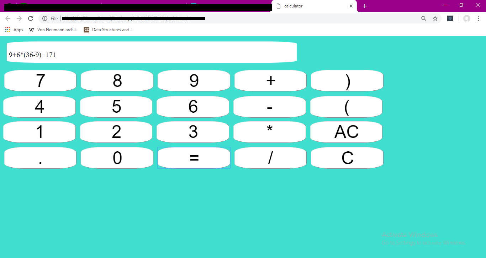

# Calculator
A simple calculator that takes in input according to the buttons made using HTML and CSS. The use of eval() function of JavaScript to perform BODMAS operations on the given string of inputs. There is output on the screen only for valid inputs, not for invalid inputs. Further operations can be performed on the output obtained.

